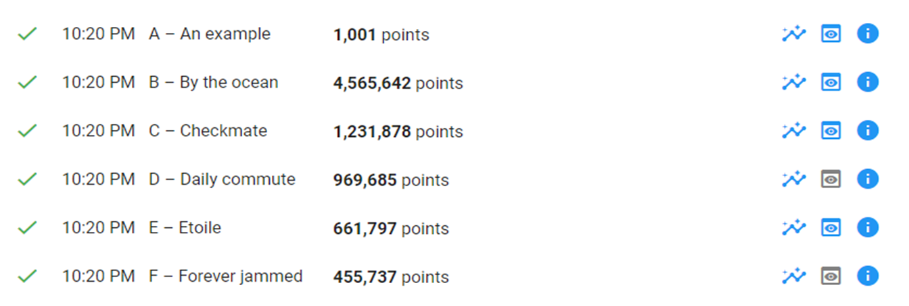
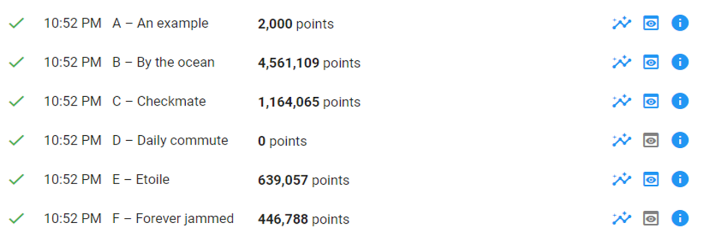
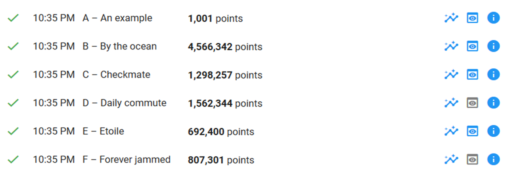
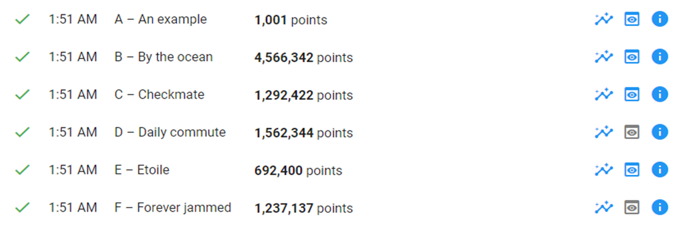
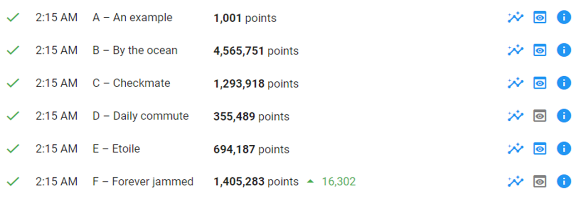
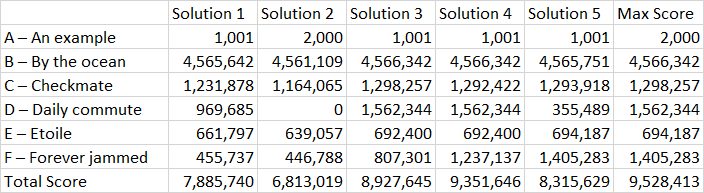

# Google-Hash-Code-2021---Traffic-Signaling

Solution for the Google [hash code 2021](https://codingcompetitions.withgoogle.com/hashcode/archive) done by 4Ô4 team. 
This documentation contains the different attempts to reach a score of **9,528,413**. 
 
More details:[Problem Statement](https://storage.googleapis.com/coding-competitions.appspot.com/HC/2021/hashcode_2021_online_qualification_round.pdf)  

<h2>Attempt 1: </h2>
Straightforward solution by grouping all incoming streets with their end intersection (where we have the related traffic light). 
Turn on every traffic light for 1 sec. 

<h3 style="text-align: center">Result = 7,885,740 points</h3>
<h2>Attempt 2: </h2>
Straightforward solution by grouping all incoming streets with their end intersection (where we have the related traffic light). 
Turn on every traffic light for 2 sec. 

<h3 style="text-align: center">Result = 6,813,019 points</h3>
<h2>Attempt 3: </h2>
Filter out unused streets and then group all incoming streets with their end intersection (where we have the related traffic light). 
Turn on every traffic light for 1 sec + keep used streets 

<h3 style="text-align: center">Result = 8,927,645 points</h3>
<h2>Attempt 4: </h2>
Filter out unused streets and then group all incoming streets with their end intersection (where we have the related traffic light). 
Filter out unused streets and then group all incoming streets with their end intersection (where we have the related traffic light). 

<h3 style="text-align: center">Result = 8,927,645 points</h3>
<h2>Attempt 5: </h2>
Filter out unused streets and then group all incoming streets with their end intersection (where we have the related traffic light). 
Calculate the street weight (nbOfPassingCars/averageNbOfPassingCars) and turn on every traffic light for 1 sec, or the streetWeight sec + keep used streets. 

<h3 style="text-align: center">Result = 8,315,629 points</h3>

<h2>Final Result: </h2>

